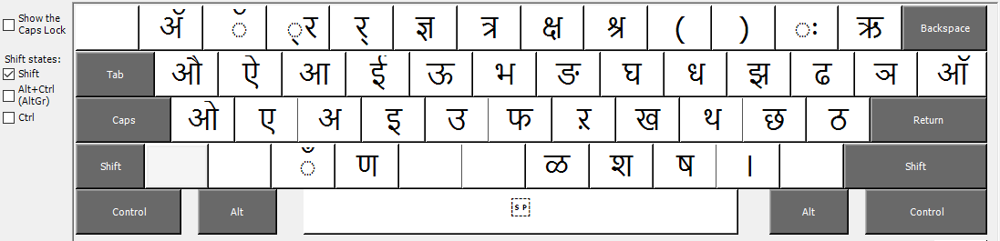

Introduction
============
The default Marathi INSCRIPT keyboard on Windows 10 is missing the enhanced INSCRIPT layout proposed by "Enhanced INSCRIPT keyboard layout 5.2" document. The enhanced layout still lacks access to punctuation via AltGr (or Ctrl + Alt) modifier key. Here, I present a modified "Enhanced INSCRIPT keyboard layout" that supports punctuation such as "?", "!", etc. without changing the keyboard to English.

Installer
=========
[This](https://github.com/iaswtw/mr-inscript-punct/releases/latest) is the latest release.  Download the Installer zip file in it.  It contains the installer for the slightly modified layout to overcome the shortcomings of the default INSCRIPT keyboard.

[This source](https://github.com/iaswtw/mr-inscript-punct/blob/master/source/Marathi%20Enhanced%20INSCRIPT%20with%20Punctuation.klc) file was used to create the installer using [Microsoft Keyboard Layout Creator 1.4](https://www.microsoft.com/en-us/download/details.aspx?id=22339). 

Layout
======
### Main layout, i..e Without Shift or AltGr pressed

### With Shift pressed

### With AltGr pressed

Note the [ZWJ](https://en.wikipedia.org/wiki/Zero-width_joiner) (Zero Width Joiner) and [ZWNJ](https://en.wikipedia.org/wiki/Zero-width_non-joiner) (Zero Width Non Joiner) on keys `१` and `२` respectively.

### With Shift and AltGr pressed

The Enhanced INSSCRIPT layout proposal has `ऽ` on English `>` key. Hence `ऽ` was moved to English `Z`.
